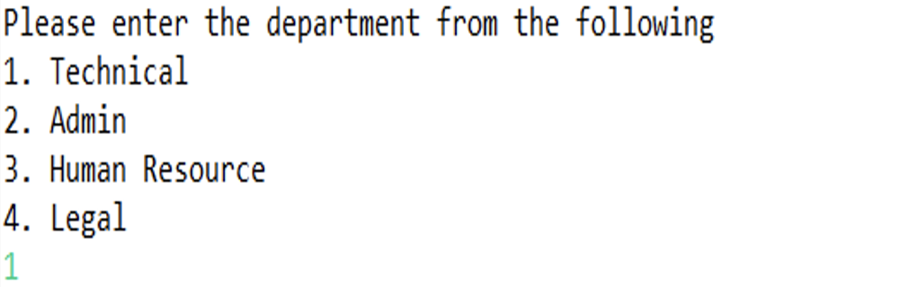
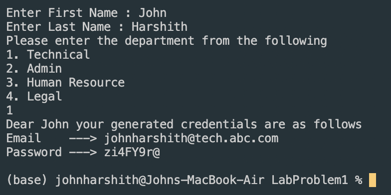

# John Harshith DSA Lab Solution

## Problem Statement

You are an IT Administrator and are charged with the task of creating credentials for new hires

Your application should do the following :

1. Generate an email with the following syntax - firstNamelastName@department.company.com
2. Determine the department (technical, admin, human resource, legal)
3. Generate a random password which will contain (number, capital letter, small letter & special character)
4. Display the generated credentials
5. Use parameterized constructor of class Employee, to pass firstName, lastName.
6. Create a separate CredentialService which will have generatePassword, generateEmailAddress, & showCredentials method.

## Sample Output

\
Dear Harshit your generated credentials are as follows\
Email    ---> harshitchoudary@tech.abc.com\
Password ---> 181E@wFT

## Problem Output

\
Dear John your generated credentials are as follows\
Email    ---> johnharshith@tech.abc.com\
Password ---> zi4FY9r@
